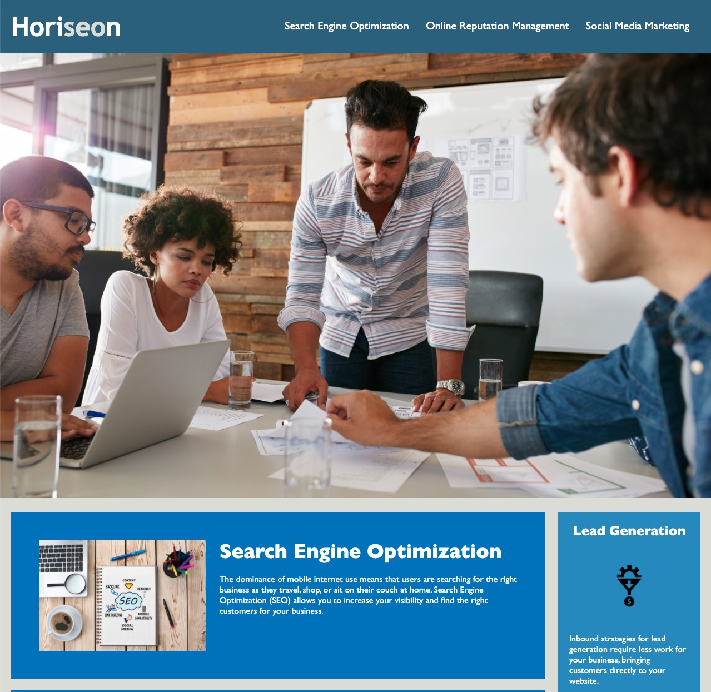
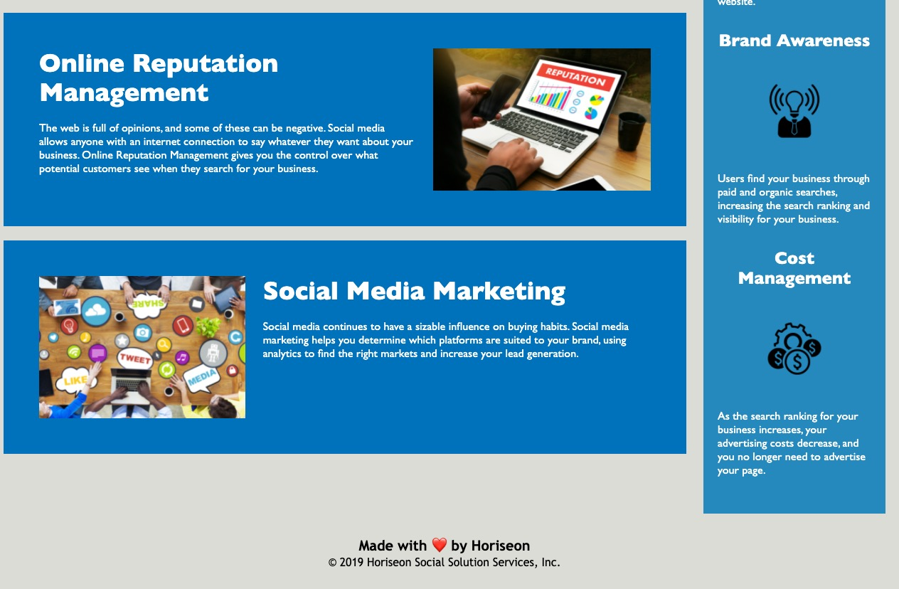

# Week One Challenge
## Description

Provide a short description explaining the what, why, and how of your project. Use the following questions as a guide:
- We refactored the Horiseon Social Solution Services page in order to be more accessible for SEO Purposes. We updated Alt Text on images, refactored HTML to use semantic HTML5 Elements, added a descriptive title, and paired down the CSS.

## Table of Contents (Optional)

- [Installation](#installation)
- [Usage](#usage)
- [Credits](#credits)
- [License](#license)

## Installation

You can view this page at this Github Pages Link: https://emdok.github.io/run-buddy/ 

## Usage

Screenshots of the finished website:

## Credits

- Collaborators: Emily Dokken 
- GitHub Profile: https://github.com/emdok
- Assignment: https://courses.bootcampspot.com/courses/939/assignments/18761?module_item_id=336113 

## License

MIT License

Copyright (c) 2021 Emily Dokken

Permission is hereby granted, free of charge, to any person obtaining a copy
of this software and associated documentation files (the "Software"), to deal
in the Software without restriction, including without limitation the rights
to use, copy, modify, merge, publish, distribute, sublicense, and/or sell
copies of the Software, and to permit persons to whom the Software is
furnished to do so, subject to the following conditions:

The above copyright notice and this permission notice shall be included in all
copies or substantial portions of the Software.

THE SOFTWARE IS PROVIDED "AS IS", WITHOUT WARRANTY OF ANY KIND, EXPRESS OR
IMPLIED, INCLUDING BUT NOT LIMITED TO THE WARRANTIES OF MERCHANTABILITY,
FITNESS FOR A PARTICULAR PURPOSE AND NONINFRINGEMENT. IN NO EVENT SHALL THE
AUTHORS OR COPYRIGHT HOLDERS BE LIABLE FOR ANY CLAIM, DAMAGES OR OTHER
LIABILITY, WHETHER IN AN ACTION OF CONTRACT, TORT OR OTHERWISE, ARISING FROM,
OUT OF OR IN CONNECTION WITH THE SOFTWARE OR THE USE OR OTHER DEALINGS IN THE
SOFTWARE.

## Tests

You can test this page using Chrome's Web Developer Tools, specifically their Lighthouse Tool after opening the page:

1. Head to the GitHub Page for the website here: https://emdok.github.io/run-buddy/ 
2. Open Chrome Dev Tools
3. Select LightHouse
4. Select Accessibility
5. Click Generate Report

https://developers.google.com/web/tools/lighthouse 